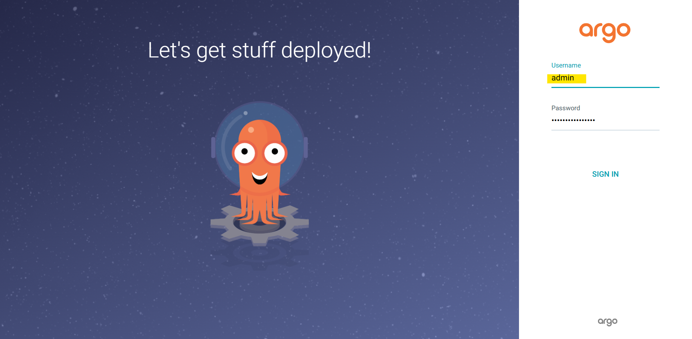
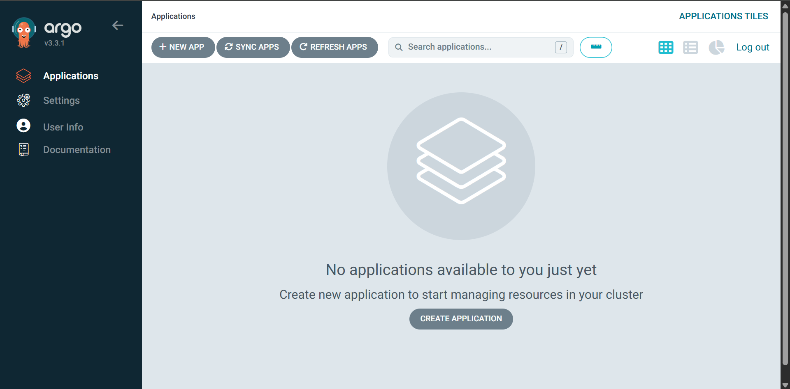
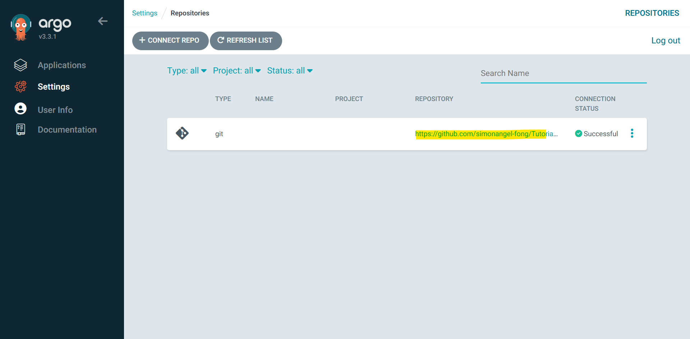
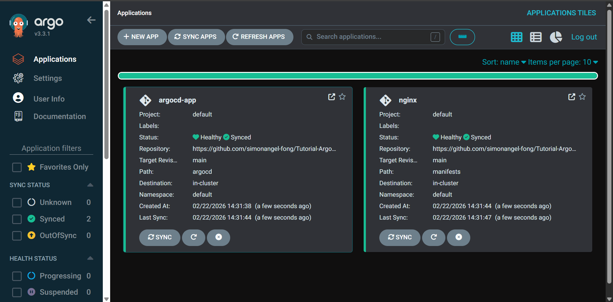
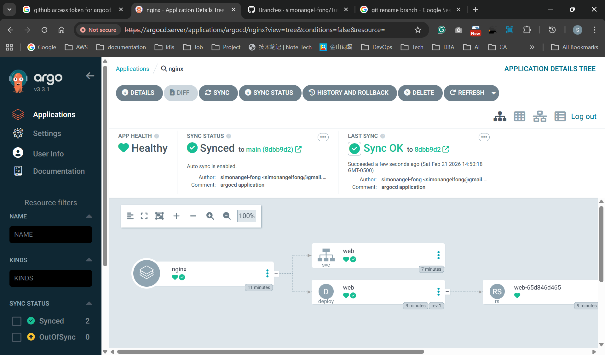
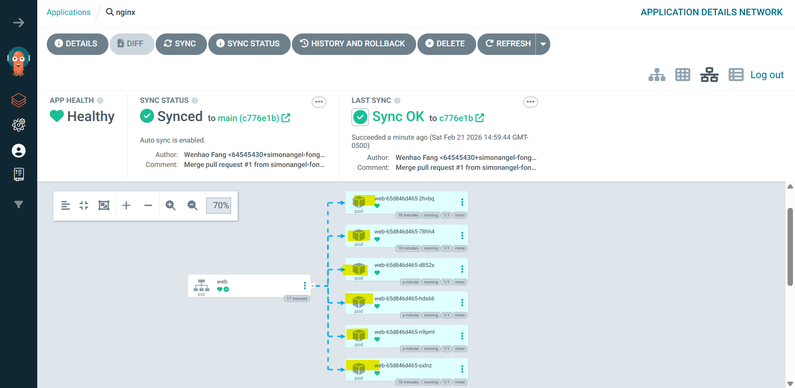
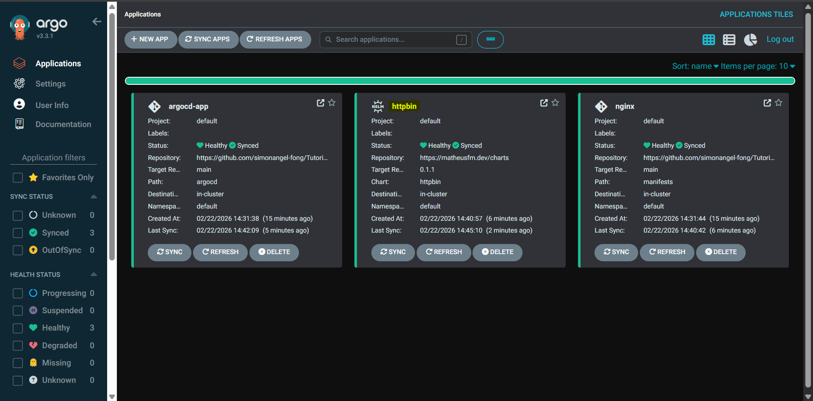

# ArgoCD

[Back](../README.md)

- [ArgoCD](#argocd)
  - [ArgoCD](#argocd-1)
    - [Architecture Components](#architecture-components)
    - [Imperative Command](#imperative-command)
  - [Installation](#installation)
    - [Install with Helm](#install-with-helm)
    - [Enable Ingress access](#enable-ingress-access)
  - [CLI](#cli)
    - [Installation](#installation-1)
    - [login](#login)
    - [Update new pwd](#update-new-pwd)
  - [Lab](#lab)
    - [Add Repo](#add-repo)
  - [Lab: Manually Create ArgoCD Application](#lab-manually-create-argocd-application)
    - [Create k8s Manifest](#create-k8s-manifest)
    - [Create Argocd Application Manifest](#create-argocd-application-manifest)
    - [Deploy Argocd Application Manually](#deploy-argocd-application-manually)
    - [Update, Branch, and Merge](#update-branch-and-merge)
    - [Delete Application](#delete-application)
  - [Lab: Create ArgoCD Application with remote Helm](#lab-create-argocd-application-with-remote-helm)
  - [Lab: Create ArgoCD Application with Local Helm](#lab-create-argocd-application-with-local-helm)

---

## ArgoCD

- `ArgoCD`
  - an open-source, **declarative** `continuous delivery (CD)` tool designed specifically for Kubernetes to automate application deployment using `GitOps` principles.

---

### Architecture Components

- `API Server`:
  - responsible to process API requests from users, interact with k8s API, and monitor the state of the cluster.
  - use k8s RBAC for authentication and authorization.
- `Repository Server (Repo Server)`
  - responsible to manage the `git repository`, interact with git to **pull** the configuration and deployment data, and **store** the data in a local cache for faster retrieval.
- `Application Controller`:
  - responsible to **update** the k8s objects, use k8s controller to manage the cluster state,
    - A `Kubernetes controller` that continuously **monitors** running applications.
  - It compares the live state of the application in the cluster with the desired state generated by the Repo Server. If a deviation (configuration drift) is detected, it flags the application as OutOfSync and can automatically or manually sync the live state to match the desired state in Git.
- `redis`:
  - responsible to **store** metadata about the app and resources in the cluster
- `prometheus+Grafana`
  - not built-in components, install separately
  - responsible to **monitor** the health and performance of the k8s cluster, **collect the metrics** from ArgoCD and k8s，and provide a UI for querying the performance data.

---

### Imperative Command

- Repo management

| CMD                                                           | DESC                                                  |
| ------------------------------------------------------------- | ----------------------------------------------------- |
| `argocd repo add REPO_URL --username UNAME --password SECRET` | Add git repo                                          |
| `argocd repo add REPO_URL --type helm --name stable`          | Add a public Helm repository named 'stable' via HTTPS |
| `argocd repo get REPO_URL`                                    | Get a configured repository by URL                    |
| `argocd repo list`                                            | List all repositories                                 |
| `argocd repo rm REPO_URL`                                     | Remove configured repositories                        |

- App management

| CMD                                                                                                                                                    | DESC                                    |
| ------------------------------------------------------------------------------------------------------------------------------------------------------ | --------------------------------------- |
| `argocd app list`                                                                                                                                      | List applications                       |
| `argocd app create APPNAME --repo REPO_URL --path PATH --dest-namespace NS --dest-server https://kubernetes.default.svc --directory-recurse`           | Create an application from a dir        |
| `argocd app create APPNAME --repo REPO_URL --path PATH --dest-namespace NS --dest-server https://kubernetes.default.svc --helm-set KEY=VALUE`          | Create an application from a helm dir   |
| `argocd app create APPNAME --repo REPO_URL --helm-chart HELM --revision VERSION --dest-namespace default --dest-server https://kubernetes.default.svc` | Create a Helm app from a Helm repo      |
| `argocd app delete APPNAME`                                                                                                                            | Delete an application                   |
| `argocd app sync APPNAME`                                                                                                                              | Sync an application to its target state |

---

## Installation

### Install with Helm

- ref: https://argoproj.github.io/argo-helm/

```sh
# add repo
helm repo add argo https://argoproj.github.io/argo-helm
# "argo" has been added to your repositories

helm repo ls
# NAME                    URL
# argo                    https://argoproj.github.io/argo-helm

helm repo update
# Hang tight while we grab the latest from your chart repositories...
# ...Successfully got an update from the "argo" chart repository
# Update Complete. ⎈Happy Helming!⎈

# confirm chart in repo
helm search repo argocd
# NAME                            CHART VERSION   APP VERSION     DESCRIPTION
# argo/argo-cd                    3.35.4          v2.2.5          A Helm chart for ArgoCD, a declarative, GitOps ...

# create ns
kubectl create ns argocd
# namespace/argocd created

# install helm chart
helm install argocd -n argocd argo/argo-cd
# NAME: argocd
# LAST DEPLOYED: Fri Feb 20 21:20:58 2026
# NAMESPACE: argocd
# STATUS: deployed
# REVISION: 1
# TEST SUITE: None
# NOTES:
# In order to access the server UI you have the following options:

# 1. kubectl port-forward service/argocd-server -n argocd 8080:443

#     and then open the browser on http://localhost:8080 and accept the certificate

# 2. enable ingress in the values file `server.ingress.enabled` and either
#       - Add the annotation for ssl passthrough: https://argo-cd.readthedocs.io/en/stable/operator-manual/ingress/#option-1-ssl-passthrough
#       - Set the `configs.params."server.insecure"` in the values file and terminate SSL at your ingress: https://argo-cd.readthedocs.io/en/stable/operator-manual/ingress/#option-2-multiple-ingress-objects-and-hosts


# After reaching the UI the first time you can login with username: admin and the random password generated during the installation. You can find the password by running:

# kubectl -n argocd get secret argocd-initial-admin-secret -o jsonpath="{.data.password}" | base64 -d

# (You should delete the initial secret afterwards as suggested by the Getting Started Guide: https://argo-cd.readthedocs.io/en/stable/getting_started/#4-login-using-the-cli)

# confirm
helm list -n argocd
# NAME    NAMESPACE       REVISION        UPDATED                                 STATUS          CHART             APP VERSION
# argocd  argocd          1               2026-02-20 21:20:58.607033566 -0500 EST deployed        argo-cd-9.4.3     v3.3.1

# decode the pwd
kubectl -n argocd get secret argocd-initial-admin-secret -o jsonpath="{.data.password}" | base64 -d

# reach ui, using --address 0.0.0.0 to listen the external traffic
kubectl port-forward -n argocd svc/argocd-server 8080:443 --address 0.0.0.0
```

- First login
  - username: admin
  - pwd: decoded pwd




---

### Enable Ingress access

- Ref: https://argo-cd.readthedocs.io/en/stable/operator-manual/ingress/#option-2-ssl-termination-at-ingress-controller

```sh
# setup secret
openssl req -x509 -nodes -days 365 -newkey rsa:2048 -keyout argocd_server.key -out argocd_server.crt -subj "/CN=argocd.server"

kubectl -n argocd create secret tls argocd-server-tls --cert=argocd_server.crt --key=argocd_server.key

# define ingress: SSL Termination
tee argocd-ingress.yaml<<EOF
apiVersion: networking.k8s.io/v1
kind: Ingress
metadata:
  name: argocd-server-http-ingress
  namespace: argocd
  annotations:
    nginx.ingress.kubernetes.io/force-ssl-redirect: "true"
    nginx.ingress.kubernetes.io/backend-protocol: "HTTP"
spec:
  ingressClassName: nginx
  rules:
  - host: argocd.server
    http:
      paths:
      - path: /
        pathType: Prefix
        backend:
          service:
            name: argocd-server
            port:
              name: http
  tls:
  - hosts:
    - argocd.server
    secretName: argocd-server-tls
EOF

kubectl apply -f argocd-ingress.yaml
# ingress.networking.k8s.io/argocd-server-http-ingress created

# confirm
kubectl get ingress -n argocd
# NAME                         CLASS   HOSTS           ADDRESS          PORTS     AGE
# argocd-server-http-ingress   nginx   argocd.server   192.168.10.200   80, 443   57s

# upgrade and set values
helm upgrade argocd -n argocd --set configs.params."server\.insecure"=true argo/argo-cd

# confirm values
helm get values argocd -n argocd
# USER-SUPPLIED VALUES:
# configs:
#   params:
#     server.insecure

```

- Access UI
  - https://argocd.server/

---

## CLI

### Installation

- windows: https://argo-cd.readthedocs.io/en/stable/cli_installation/#windows

```sh
# confirm
argocd version
# argocd: v3.3.1+326a1db
#   BuildDate: 2026-02-18T12:10:04Z
#   GitCommit: 326a1dbd6b9f061207f814049f88e73fd8880c55
#   GitTreeState: clean
#   GoVersion: go1.25.5
#   Compiler: gc
#   Platform: windows/amd64
# {"level":"fatal","msg":"Argo CD server address unspecified","time":"2026-02-20T23:13:47-05:00"}

```

- Linux: https://argo-cd.readthedocs.io/en/stable/cli_installation/#linux-and-wsl

```sh
curl -sSL -o argocd-linux-amd64 https://github.com/argoproj/argo-cd/releases/latest/download/argocd-linux-amd64
sudo install -m 555 argocd-linux-amd64 /usr/local/bin/argocd
rm argocd-linux-

# confirm
argocd version
# argocd: v3.3.1+326a1db
#   BuildDate: 2026-02-18T12:10:04Z
#   GitCommit: 326a1dbd6b9f061207f814049f88e73fd8880c55
#   GitTreeState: clean
#   GoVersion: go1.25.5
#   Compiler: gc
#   Platform: linux/amd64
# {"level":"fatal","msg":"Argo CD server address unspecified","time":"2026-02-21T12:04:27-05:00"}
```

---

### login

```sh
argocd login argocd.server --insecure
# {"level":"warning","msg":"Failed to invoke grpc call. Use flag --grpc-web in grpc calls. To avoid this warning message, use flag --grpc-web.","time":"2026-02-21T12:07:22-05:00"}
# Username: admin
# Password:
# 'admin:login' logged in successfully
# Context 'argocd.server' updated

# confirm
argocd repo list
# TYPE  NAME  REPO  INSECURE  OCI  LFS  CREDS  STATUS  MESSAGE  PROJECT
```

---

### Update new pwd

```sh
argocd account update-password --current-password old_pwd --new-password "new_pwd"
# Password updated
# Context 'argocd.server' updated
```

---

## Lab

### Add Repo

- Create access token in GitHub

```sh
# add repo in argocd
argocd repo add https://github.com/simonangel-fong/Tutorial-ArgoCD.git --username "uname" --password "pwd"
# Repository 'https://github.com/simonangel-fong/Tutorial-ArgoCD.git' added

argocd repo list
# TYPE  NAME  REPO                                                    INSECURE  OCI    LFS    CREDS  STATUS      MESSAGE  PROJECT
# git         https://github.com/simonangel-fong/Tutorial-ArgoCD.git  false     false  false  false  Successful

# confirm secret created
kubectl get secrets -n argocd
# NAME                           TYPE                 DATA   AGE
# repo-3053994773                Opaque               4      61s
```

- Confirm in UI



---

## Lab: Manually Create ArgoCD Application

### Create k8s Manifest

```sh
# repo/
mkdir manifests

# ##############################
# Create k8s manifest
# ##############################
tee manifests/web.yaml<<EOF
# web.yaml
apiVersion: apps/v1
kind: Deployment
metadata:
  labels:
    app: web
  name: web
spec:
  replicas: 6
  selector:
    matchLabels:
      app: web
  template:
    metadata:
      labels:
        app: web
    spec:
      containers:
      - image: nginx
        name: nginx
---
apiVersion: v1
kind: Service
metadata:
  labels:
    app: web
  name: web
spec:
  ports:
  - port: 80
    protocol: TCP
    targetPort: 80
  selector:
    app: web
EOF

git add .
git commit -m "add k8s manifests"
git push

```

### Create Argocd Application Manifest

```sh
# ##############################
# Create argocd application
# ##############################
# repo/
mkdir argocd

tee argocd/argocd_manifest.yaml<<EOF
apiVersion: argoproj.io/v1alpha1
kind: Application
metadata:
  name: nginx
  namespace: argocd
spec:
  project: default

  source:
    repoURL: "https://github.com/simonangel-fong/Tutorial-ArgoCD.git"
    targetRevision: main # branch
    path: manifests

  destination:
    server: https://kubernetes.default.svc
    namespace: default

  # Sync policy
  syncPolicy:
    automated:
      prune: true
      selfHeal: true
EOF

git add .
git commit -m "add argocd manifests"
git push

```

---

### Deploy Argocd Application Manually

```sh
# ##############################
# Create argocd application
# ##############################
tee ./argocd_app.yaml<<EOF
apiVersion: argoproj.io/v1alpha1
kind: Application
metadata:
  name: argocd-app
  namespace: argocd
spec:
  project: default

  source:
    repoURL: "https://github.com/simonangel-fong/Tutorial-ArgoCD.git"
    targetRevision: main # branch
    path: argocd

  destination:
    server: https://kubernetes.default.svc
    namespace: default

  # Sync policy
  syncPolicy:
    automated:
      prune: true
      selfHeal: true
EOF

# create application manually
kubectl apply -f ./argocd_app.yaml
# application.argoproj.io/argocd-app created

argocd app list
# NAME          CLUSTER                         NAMESPACE  PROJECT  STATUS  HEALTH   SYNCPOLICY  CONDITIONS  REPO                                                    PATH       TARGET
# argocd/nginx  https://kubernetes.default.svc  default    default  Synced  Healthy  Auto-Prune  <none>      https://github.com/simonangel-fong/Tutorial-ArgoCD.git  manifests  main
```

- Confirm




---

### Update, Branch, and Merge

```sh
git checkout -b feature/increase-
# Switched to a new branch 'feature/increase-replic

# update manifest
vi manifest/deployment.yaml
# replicas: 6

git commit -m "increate replicas count"
git push --set-upstream origin feature/increase-replicas
```

- create pr and merg in github
- Confirm the application has been updated



---

### Delete Application

```sh
argocd app delete argocd/nginx
# Are you sure you want to delete 'argocd/nginx' and all its resources? [y/n] y
# application 'argocd/nginx' deleted

# confirm
argocd app list
# NAME  CLUSTER  NAMESPACE  PROJECT  STATUS  HEALTH  SYNCPOLICY  CONDITIONS  REPO  PATH  TARGET
```

---

## Lab: Create ArgoCD Application with remote Helm

```sh
# repo
tee argo-cd/argocd_helm.yaml<<EOF
apiVersion: argoproj.io/v1alpha1
kind: Application
metadata:
  name: httpbin
  namespace: argocd
spec:
  project: default

  source:
    helm:
      releaseName: httpbin
      values: |
        service:
          type: NodePort
    chart: httpbin
    repoURL: "https://matheusfm.dev/charts"
    targetRevision: 0.1.1

  destination:
    server: https://kubernetes.default.svc
    namespace: default

  # Sync policy
  syncPolicy:
    automated:
      prune: true
      selfHeal: true
EOF

git checkout -b feature/argocd-helm-httpbin
# Switched to a new branch 'feature/argocd-helm-httpbin'
git add argocd/argocd_helm.yaml
git commit -m "argocd: add httpbin helm chart"
git push

argocd app sync argocd-app
# TIMESTAMP                  GROUP              KIND    NAMESPACE                  NAME    STATUS   HEALTH        HOOK  MESSAGE
# 2026-02-22T14:40:54-05:00  argoproj.io  Application      argocd                 nginx    Synced
# 2026-02-22T14:42:09-05:00  argoproj.io  Application      argocd               httpbin   Running   Synced              application.argoproj.io/httpbin created
# 2026-02-22T14:42:09-05:00  argoproj.io  Application      argocd                 nginx    Synced                       application.argoproj.io/nginx unchanged

# Name:               argocd/argocd-app
# Project:            default
# Server:             https://kubernetes.default.svc
# Namespace:          default
# URL:                https://argocd.example.com/applications/argocd-app
# Source:
# - Repo:             https://github.com/simonangel-fong/Tutorial-ArgoCD.git
#   Target:           main
#   Path:             argocd
# SyncWindow:         Sync Allowed
# Sync Policy:        Automated (Prune)
# Sync Status:        Synced to main (52d0d60)
# Health Status:      Healthy

# Operation:          Sync
# Sync Revision:      52d0d6060d3eb76d02254844235e7f6256c7d301
# Phase:              Succeeded
# Start:              2026-02-22 14:40:53 -0500 EST
# Finished:           2026-02-22 14:42:09 -0500 EST
# Duration:           1m16s
# Message:            successfully synced (all tasks run)

# GROUP        KIND         NAMESPACE  NAME     STATUS  HEALTH  HOOK  MESSAGE
# argoproj.io  Application  argocd     httpbin  Synced                application.argoproj.io/httpbin created
# argoproj.io  Application  argocd     nginx    Synced                application.argoproj.io/nginx unchanged
```



---

## Lab: Create ArgoCD Application with Local Helm

- Create helm chart in repo

```sh
# repo
mkdir helm
cd helm

helm create httpd
# Creating httpd

# update valuse:
cd httpd
vi values.yaml
# image:
#   repository: httpd
#   tag: latest

# package charts
helm package .
# Successfully packaged chart and saved it to: helm/httpd/httpd-0.1.0.tgz

# index helm chart to enable github repo as remote helm repo
helm repo index helm/httpd --url https://github.com/simonangel-fong/Tutorial-ArgoCD/helm/httpd

mv helm/httpd/index.yaml ./index.yaml


helm repo add test https://github.com/simonangel-fong/Tutorial-ArgoCD.git
```

- Create argicd manifest to create application with created helm chart

```sh
# repo
tee argo-cd/argocd_helm.yaml<<EOF
apiVersion: argoproj.io/v1alpha1
kind: Application
metadata:
  name: httpbin
  namespace: argocd
spec:
  project: default

  source:
    helm:
      releaseName: httpbin
      values: |
        service:
          type: NodePort
    chart: httpbin
    repoURL: "https://matheusfm.dev/charts"
    targetRevision: 0.1.1

  destination:
    server: https://kubernetes.default.svc
    namespace: default

  # Sync policy
  syncPolicy:
    automated:
      prune: true
      selfHeal: true
EOF
```